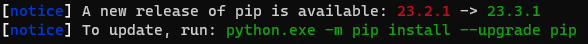
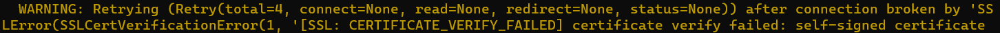

### try
>이전에 학부 시절 때, 구글 코랩을 통해서 샘플 csv 파일들을 받아서 클라우드 환경에서 실습을 했던 경험이 있다, 하지만 회사 보안 정책 때문에 visual code에 python을 통해서 로컬 환경에서 진행해 볼 예정이다. 

### 일단은 Pandas를 깔아보자
> 파이썬을 visual code 깔았다는 가정하에 시작하는 튜토리얼이다.
> * 파이썬 라이브러리를 가져오기 위해서는 pipeline이라는 기능을 파이썬에서 지원한다. 파이썬을 설치했다면 기본적으로 pip가 설치해 있을 것이다.

1. pandas 설치 
pandas를 설치할 때, 다음과 같이 pip 버전을 업그레이드 하라는 얘기가 나올 수 있다.

그래서 초록 글씨에 나온 것처럼 pip를 업그레이드 해준다.

## python.exe install pip

### Trouble_shooting
pip을 통해 라이브러리를 불러올 때, 우리의 착한 방화벽(^^) 씨는 SSL 인증이 안되서 다음과 같은 그지 같은 오류들을 불러올 수 있다.

이런 문

